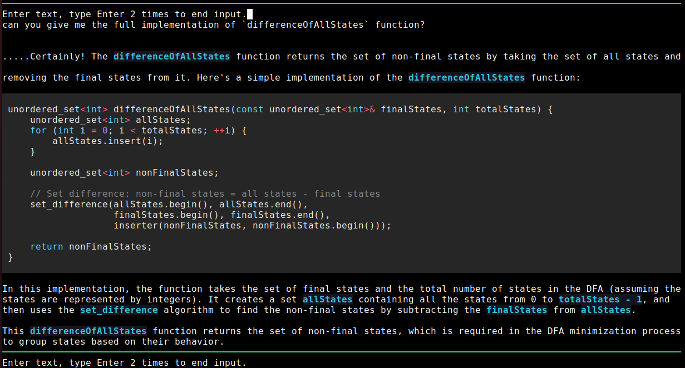

# ChatGPT console client

---



---

Hey there! 🚀 

_remember to add your `OPENAI_API_KEY` to env_

---

Because we're using the Assistant API, we only support two models: `gpt-4-1106-preview` and `gpt-3.5-turbo-1106`. By default, we use the latter, but you can change it using the command line:

```bash
gptc.py --model gpt-4-1106-preview
```

By default, our system is geared towards assisting you with programming-related queries. If you'd like to change that, you have two options:

- Edit the `system_prompt.txt` file, which is loaded as the default system instruction.
- Use the `--instructions` argument like this:

    ```bash
    gptc.py --instructions "please help me to understand DFA, and using c++ to write code snippet"
    ```

---

Let's have a great conversation! 🗨️
